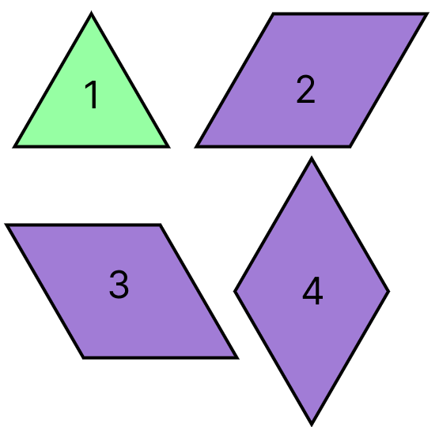
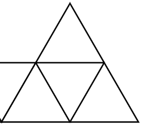

## 🔗 문제 링크
[산모양타일링](https://school.programmers.co.kr/learn/courses/30/lessons/258705)

## 💻 코드
```java
class Solution {
    public int solution(int n, int[] tops) {
        int answer = 0;
        int [][] dp = new int[n][2]; // 0 일 경우 오른쪽 존재, 1일 경우 오른쪽 존재 x
        int mod = 10007;
        if(tops[0] == 1){
            dp[0][0] = 1;
            dp[0][1] = 3;
        }else{
            dp[0][0] =1;
            dp[0][1] = 2;
        }
        
        for(int i=1;i<n;i++){
            if(tops[i] == 1){ // top이 존재 할 때
                dp[i][0] = (dp[i-1][0] + dp[i-1][1] )%mod;
                dp[i][1] = (dp[i-1][0] * 2 + dp[i-1][1] * 3)%mod;
            }else{
                dp[i][0] = (dp[i-1][0] + dp[i-1][1])%mod;
                dp[i][1] = (dp[i-1][0] + dp[i-1][1] * 2)%mod;
            }
        }

        return (dp[n-1][0] + dp[n-1][1])%mod;
    }
}
```

## 📝 해설

위와 같이 도형에 번호를 매겼다고 가정하자.



이 문제는 그림의 가운데 삼각형에 위 타일 중 어떤 타일이 들어갈 수 있는지를 기준으로 잡고 풀면 된다.

3번, 4번 모양을 가운데 타일에 배치할 경우 고려해야 하는 경우가 발생한다.

3번을 넣게되면 1,2,4번을 넣었을 때와 다르게 오른쪽(위 사진 기준 5시 방향) 삼각형을 채우게 된다. 만약 i번째 가운데 삼각형에 3번을 넣게 되면 i + 1번째 가운데 삼각형에는 2번이 들어올 수 없다.

4번의 경우 1,2,3번과 다르게 위쪽(위 사진 기준 12시 방향) 삼각형을 채우게 된다. 4번의 경우는 top이 1인 경우에만 가능하다.

위 두 가지 경우만 잘 처리해주면 dp로 문제를 해결 할 수 있다.

`dp[i][0]`은 i번째 삼각형을 채울 때 오른쪽 삼각형도 같이 채우는 경우의 수, 즉 3번을 배치하는 경우이고 `dp[i][1]`은 3번을 배치하지 않는 경우의 수이다.
`dp[0]`에 들어가는 값은 다음과 같다. 

```java
if(tops[0] == 1){
    dp[0][0] = 1;
    dp[0][1] = 3;
}else{
    dp[0][0] =1;
    dp[0][1] = 2;
}
```
무조건 dp[i][0]에는 3번 타일만 들어갈 수 있기 때문에 1이 된다.
dp[i][1]에는 1,2,4번 타일이 들어갈 수 있지만 top이 0인 경우 4번이 들어갈 수 없으므로 1,2만 가능하다.

```java
for(int i=1;i<n;i++){
    if(tops[i] == 1){ // top이 존재 할 때
        dp[i][0] = (dp[i-1][0] + dp[i-1][1] )%mod;
        dp[i][1] = (dp[i-1][0] * 2 + dp[i-1][1] * 3)%mod;
    }else{
        dp[i][0] = (dp[i-1][0] + dp[i-1][1])%mod;
        dp[i][1] = (dp[i-1][0] + dp[i-1][1] * 2)%mod;
    }
}

return (dp[n-1][0] + dp[n-1][1])%mod;
```
이후 반복문을 돌면서 top이 있는 경우와 상관없이 dp[i][0]에는 이전 번째의 오른쪽 타일이 없는 경우와 있는 경우를 더해주면 된다. 왜냐하면 3번 타일만 배치가 가능하고 3번타일은 이전에 오른쪽 타일이 있는지 없는지에 영향을 받지 않기 때문이다.

dp[i][1]에는 top이 있는 경우
   - 이전 타일에서 오른쪽 타일이 있는 경우 가운데 삼각형에 1번과 4번이 올 수 있다.(2개)
   - 이전 타일에서 오른쪽 타일이 없는 경우 가운데 삼각형에 1번, 2번, 4번이 올 수 있다.(3개)
  
  top이 없는 경우에는 4번이 올 수 없으므로 각각 1씩 빼줘야 한다.

