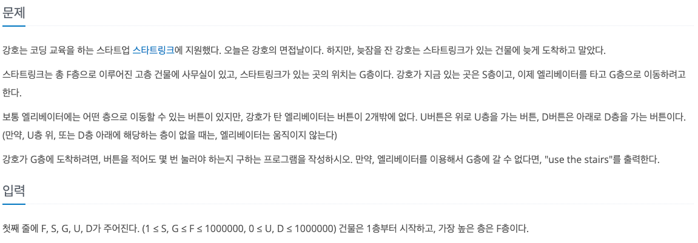
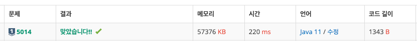

## 🔗 문제 링크
[스타트 링크]
https://www.acmicpc.net/problem/5014

## 💻 코드
```java
package BFS.S1_5014_스타트링크;

import java.io.*;
import java.util.*;

public class Main {
    public static int F,S,G,U,D,result = 0;
    public static int[] visited;
    public static void main(String[] args) throws IOException {
        //BufferedReader br = new BufferedReader(new InputStreamReader(System.in));
        BufferedReader br = new BufferedReader(new FileReader("src/input.txt"));
        StringTokenizer st = new StringTokenizer(br.readLine());
        StringBuilder sb = new StringBuilder();

        F = Integer.parseInt(st.nextToken());
        S = Integer.parseInt(st.nextToken());
        G = Integer.parseInt(st.nextToken());
        U = Integer.parseInt(st.nextToken());
        D = Integer.parseInt(st.nextToken());

        visited = new int[F+1];

        Arrays.fill(visited,-1);

        BFS();
        System.out.println(visited[G] == -1 ? "use the stairs" : visited[G]);

    }

    public static void BFS(){
        Queue<Integer> que = new LinkedList<>();
        que.add(S);
        visited[S] = 0;

        while(!que.isEmpty()){
            int n = que.poll();
            if(n == G){
                break;
            }
            if(n + U <= F && visited[n+U] == -1){
                que.add(n+U);
                visited[n+U] = visited[n]+1;

            }
            if(n - D > 0 && visited[n-D] == -1){
                que.add(n-D);
                visited[n-D] = visited[n]+1;

            }
        }

    }

}


```

## 📝 해설


최대 100만층까지 가능한 건물이고, 1층씩 움직인다고 가정했을 때 최대 O(F)로 100만번의 연산이 가능하므로
BFS - 완전탐색을 사용해도 되겠다고 생각했음 

queue를 사용해서 현재 층을 넣고 갈 수 있는 범위를 다시 queue 삽입한다. 
삽입할 때 방문배열을 통해 몇 번의 depth만에 방문했는지 입력해준다
G에 도달했을 때 visited[G]의 값만 출력해주면 해결된다.

처음 이 문제를 풀었을 때 S == G인 경우를 생각하지 못했고 틀리게 됨
문제를 다 풀고도 예외케이스를 제대로 생각하지 않아서 1트만에 풀지 못함. 
다음부터 예외 케이스를 더 생각해야할듯

## 📌 결과

