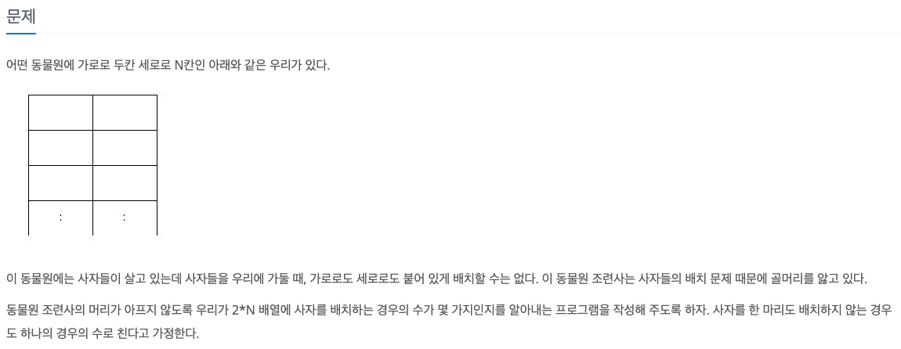
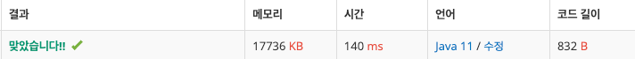

## 🔗 문제 링크
[동물원]
https://www.acmicpc.net/problem/1309

## 💻 코드
```java
package DP.S1_1309_동물원;

import java.io.*;
import java.util.*;

public class Main {
    public static int N,M;
    public static int[][] dp;
    public static void main(String[] args) throws IOException {
        //BufferedReader br = new BufferedReader(new InputStreamReader(System.in));
        BufferedReader br = new BufferedReader(new FileReader("src/input.txt"));
        StringTokenizer st = new StringTokenizer(br.readLine());
        StringBuilder sb = new StringBuilder();

        N = Integer.parseInt(st.nextToken());
        dp = new int[N][3];

        dp[0][0] = 1;
        dp[0][1] = 1;
        dp[0][2] = 1;

        for(int i=1;i<N;i++){
            dp[i][0] = (dp[i-1][0]  + dp[i-1][1] + dp[i-1][2]) % 9901;
            dp[i][1] = (dp[i-1][0] + dp[i-1][2]) % 9901;
            dp[i][2] = (dp[i-1][0] + dp[i-1][1]) % 9901;
        }

        System.out.println((dp[N-1][0] + dp[N-1][1] + dp[N-1][2]) % 9901);


    }

}


```

## 📝 해설


N이 1일 때 1) 사자가 없는 경우, 2) 사자가 왼쪽 우리에 있는 경우 3) 사자가 오른쪽 우리에 있는 경우
총 3가지의 경우가 있고 이것을 10만까지 가게 되면 시간복잡도가 O(3^n)으로 시간 초과를 하게 된다. 

그래서 DP로 풀게 되었고, 
dp[i][0] = i번째 우리에서 사자가 없는경우 
dp[i][1] = i번째 우리에서 사자가 왼쪽 배치된 경우
dp[i][2] = i번째 우리에서 사자가 오른족 배치 된 경우

3가지로
dp[i][0] = (dp[i-1][0]  + dp[i-1][1] + dp[i-1][2])
dp[i][1] = (dp[i-1][0] + dp[i-1][2]) 
dp[i][2] = (dp[i-1][0] + dp[i-1][1])

로 점화식을 세울 수 있다. 

문제 조건에서 9901로 나눈 나머지를 출력하라고 했으므로 값을 구할 때마다 9901로 나눠주고
마지막 결과값까지 9901로 나누면 결과값이 출력된다.

dp문제는 점화식만 세우면 간단한 문제이지만 점화식을 세우는 것이 항상 어렵기 때문에 규칙을 찾도록 노력해야 한다.


## 📌 결과

