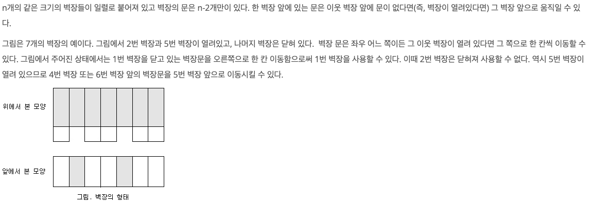

## 🔗 문제 링크
[벽장문의 이동]
https://www.acmicpc.net/problem/2666

## 💻 코드
```java
import java.io.*;
import java.util.*;

public class Main {
    public static int N,M;
    public static int[][][] open;
    public static int[] process;
    public static void main(String[] args) throws IOException {
        BufferedReader br = new BufferedReader(new InputStreamReader(System.in));
        StringTokenizer st = new StringTokenizer(br.readLine());
        StringBuilder sb = new StringBuilder();
        N = Integer.parseInt(st.nextToken());

        st = new StringTokenizer(br.readLine());
        int leftDoor = Integer.parseInt(st.nextToken());
        int rightDoor = Integer.parseInt(st.nextToken());


        M = Integer.parseInt(br.readLine());
        open = new int[N+1][N+1][M];
        process = new int[M];

        for(int i =0;i<M;i++){
            int n = Integer.parseInt(br.readLine());
            process[i] = n;
        }

        System.out.println(solve(leftDoor,rightDoor,0));


    }

    public static int solve(int left, int right, int depth){
        if(depth >= M){
            return 0;
        }

        open[left][right][depth] = Math.min(
                Math.abs(left - process[depth]) + solve(process[depth], right, depth+1 )// 왼쪽으로 갔을 경우
                ,
                Math.abs(right - process[depth]) + solve(left, process[depth], depth+1 )// 오른쪽으로
        );

        return open[left][right][depth];

    }

}

```

## 📝 해설


벽장 문을 옮기는데 가장 최소비용으로 이동할 수 있는 경우를 찾는 것이다.

이 문제에서 주의할 점은 왼쪽문은 1이고 오른쪽문은 5일때 3으로 문을 옮기려고 하면
왼쪽, 오른쪽 둘다 비용이 2이기 때문에 어느 쪽으로 이동을 시켜야 최소비용이 나오는지가 요점이다.

```java
        open[left][right][depth] = Math.min(
                Math.abs(left - process[depth]) + solve(process[depth], right, depth+1 )// 왼쪽으로 갔을 경우
                ,
                Math.abs(right - process[depth]) + solve(left, process[depth], depth+1 )// 오른쪽으로
        );
```
Math.min으로 왼쪽으로 갔을 경우와 오른쪽으로 갔을 경우의 최소값을 return으로 받아서 dp 배열을 채우는 방식으로 해결했다.


## 📌 결과

