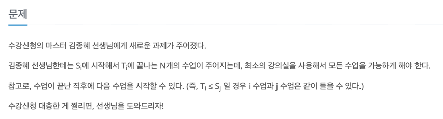
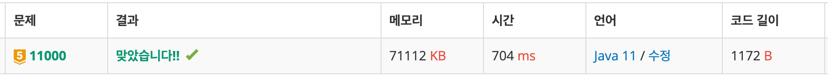

## 🔗 문제 링크
[강의실 배정]
https://www.acmicpc.net/problem/11000

## 💻 코드
```java
package 그리디.G5_11000_강의실배정;

import java.io.*;
import java.util.*;

public class Main {
    static int N;
    public static void main(String[] args) throws IOException {
        //BufferedReader br = new BufferedReader(new InputStreamReader(System.in));
        BufferedReader br = new BufferedReader(new FileReader("src/input.txt"));
        StringTokenizer st = new StringTokenizer(br.readLine());
        StringBuilder sb = new StringBuilder();

        N = Integer.parseInt(st.nextToken());

        PriorityQueue<int[]> que = new PriorityQueue<>((o1,o2)->{
            if(o1[0] == o2[0]){
                return o1[1]-o2[1];
            }else{
                return o1[0]-o2[0];
            }
        });

        for(int i =0;i<N;i++){
            st = new StringTokenizer(br.readLine());
            int n = Integer.parseInt(st.nextToken());
            int m = Integer.parseInt(st.nextToken());
            que.add(new int[]{n,m});
        }

        PriorityQueue<Integer> room = new PriorityQueue<>();
        room.add(0);

        while(!que.isEmpty()){
            int[] list = que.poll();
            if(list[0] >= room.peek()){
                room.poll();
            }
            room.add(list[1]);

        }

        System.out.println(room.size());


    }

}


```

## 📝 해설


3   
1 3   
2 4   
3 5   
의 경우에   
1~3시, 3~5시 -> 강의실 1   
2~4시 -> 강의실 2   
이렇게 답이 2가 나오게 된다. 하지만 여기서 N은 최대 20만 시간의 경우 최대 10^9

가장 먼저 시작하는 강의 찾기 -> O(N)   
각 강의마다 N개의 강의 종료시간을 확인 -> O(N) 으로 총 O(N^2)이 나오기 때문에 20만개의 경우
1초를 초과하게 된다. 


우선순위큐는 삽입과 삭제가 O(logN)이기 때문에 N개의 강의에 대해 각각 큐작업을 하므로 O(NlogN)으로 연산시간이 줄어들게 됨

많이 보이는 유형 중 하나라서 정렬을 기본적으로 생각하긴 했는데 우선순위큐를 생각못해서 시간이 조금 걸린 것 같음


## 📌 결과

