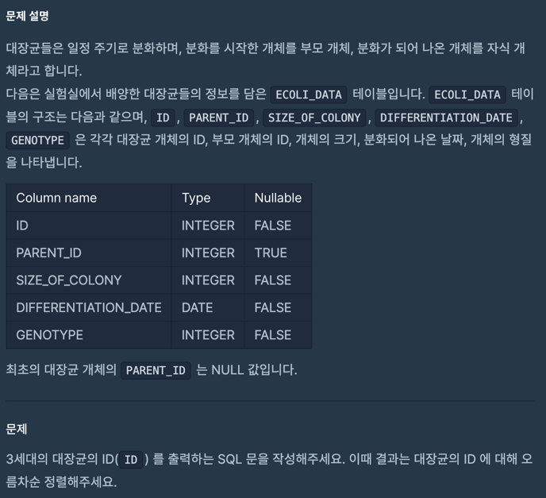
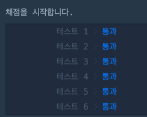

## 🔗 문제 링크
[특정 세대의 대장균 찾기]
https://school.programmers.co.kr/learn/courses/30/lessons/301650

## 💻 코드
```sql
WITH A as (
    SELECT *
    FROM ECOLI_DATA
    WHERE PARENT_ID IS NULL
), B as (
    SELECT E.*
    FROM ECOLI_DATA E
             JOIN A ON E.PARENT_ID = A.ID
)

SELECT E.ID
FROM ECOLI_DATA E
         JOIN B ON E.PARENT_ID = B.ID
ORDER BY E.ID;


```

## 📝 해설


알고리즘 문제 풀다가 너무 집중이 안돼서 SQL 문제로..

3세대의 대장균 찾기 문제라 이렇게 WITH로 만들어서 하나씩 하드코딩 식으로 만들었지만

찾는 세대가 커질 수록 코드가 길어지는 단점이 있다.

아래의 코드는 RECURSIVE를 사용해서 재귀적으로 해결한 문제이다.

이렇게 만들게 되면 세대가 커져서 숫자 몇개만 바꾸면 되기 때문에 효율적이다.

```sql
WITH RECURSIVE Ancestors AS (
    -- 1세대를 선택합니다 (최초의 조상)
    SELECT 
        ID, 
        PARENT_ID, 
        1 AS generation
    FROM 
        ECOLI_DATA
    WHERE 
        PARENT_ID IS NULL
    
    UNION ALL
    
    -- 재귀적으로 조상을 찾습니다
    SELECT 
        E.ID, 
        E.PARENT_ID, 
        A.generation + 1
    FROM 
        ECOLI_DATA E
    JOIN 
        Ancestors A ON E.PARENT_ID = A.ID
    WHERE 
        A.generation < 100  -- 100세대까지 제한
)

SELECT 
    ID
FROM 
    Ancestors
WHERE 
    generation = 3
ORDER BY 
    generation, ID;

```


## 📌 결과

