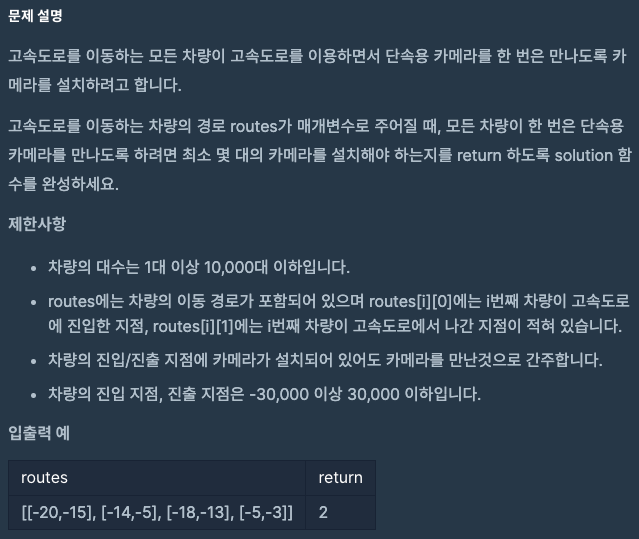

## 🔗 문제 링크
[단속카메라]
https://school.programmers.co.kr/learn/courses/30/lessons/42884#

## 💻 코드
```java
import java.util.*;

class Solution {
    public int solution(int[][] routes) {
        int answer = 0;

        Arrays.sort(routes, (o1,o2) -> {
            return o1[1] - o2[1];

        });
        int camera = routes[0][1];


        for(int i=1;i<routes.length;i++){
            if( camera < routes[i][0]){
                camera = routes[i][1];
                answer++;
            }
        }

        return answer+1;
    }
}
```

## 📝 해설


lv3 문제인데 정렬하는 것만 생각하면 어렵지 않은 문제였다.
나가지는 지점을 기준으로 오름차순 정렬을 하게 되면
-20 : -15
-18 : -13
-14 : -5
-5 : -3
이렇게 되는데 첫번째 -15를 카메라 1번으로 하고 다음 차량의 진입 시점이 현재 카메라 위치보다
클 경우 다음 차량의 나간 시점에 카메라를 설치하고 카메라 갯수를 1씩 늘리면 된다. 


## 📌 결과

