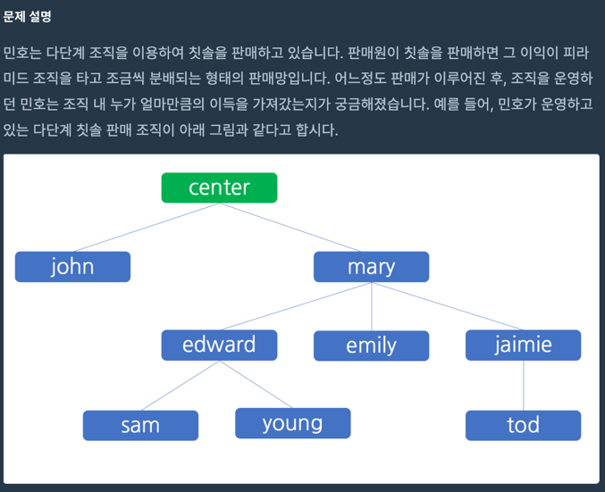
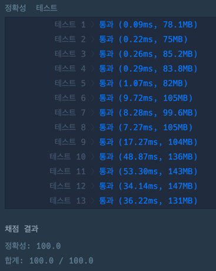

## 🔗 문제 링크
[다단계 칫솔 판매]
https://school.programmers.co.kr/learn/courses/30/lessons/77486

## 💻 코드
```java
import java.util.*;

class Solution {
    static int[] result;
    static HashMap<String, Integer> map;
    static HashMap<Integer,Integer> parent;
    public int[] solution(String[] enroll, String[] referral, String[] seller, int[] amount) {
        map = new HashMap<>();
        parent = new HashMap<>();
        result = new int[enroll.length];

        //map에 번호 넣기
        for(int i=1;i<enroll.length+1;i++){
            map.put(enroll[i-1],i);
        }


        for(int i=1;i<enroll.length+1;i++){
            int num = map.get(referral[i-1]) == null ? 0 : map.get(referral[i-1]);
            parent.put(i,num);
        }


        for(int i =0;i<seller.length;i++){
            int num = map.get(seller[i]);
            cal(num, amount[i] * 100 );

        }
        return result;
    }

    public static void cal(int num, int money){

        int mine = money;
        int yours = 0;


        if(money >= 10){
            yours = money/10;
            mine = money - yours;

        }
        result[num-1] += mine;


        if( parent.get(num) != 0 && money > 0){
            cal(parent.get(num),yours);
        }


    }
}
```

## 📝 해설


간단하게 설명하면 가장 말단 직원이 돈을 벌어오면 그 직원을 데리고 온 직원이 돈을 버는 구조를 통해 센터가 돈을 얼마나 먹는지 조사하는 내용이다.

재귀를 통해서 seller의 직원부터 부모들을 찾아가면서 금액을 result 배열에 합해주면 끝이다.
시간복잡도는 money의 최대 금액이 100*100으로 10000원이 최대이기 때문에 한 개의 seller당 최대 5번(10000 < 1000 < 100 < 10 < 1) 의 연산이 가능하다. **O(1)**
그리고 seller의 갯수가 최대 100,000이기 때문에 **O(n)** 으로 연산이 가능하다.


여기서 유의할 점은 재귀의 탈출 조건을 설정하는 일이다. 처음에는 부모가 0("-")일 경우
```java
  if( parent.get(num) != 0 )
```
에만 탈출하도록 했는데 11,12,13번의 테스트에서 시간초과가 발생함
-> 최대 5번의 연산을 통해 money가 0이 됐을 경우 부모들에게까지 갈 돈이 없기 때문에 재귀를 멈춰야하는데 멈추지 않아서 시간초과가 남
-> money > 0 조건을 넣어주니 해결
```java
  if( parent.get(num) != 0 && money > 0){
```


## 📌 결과

